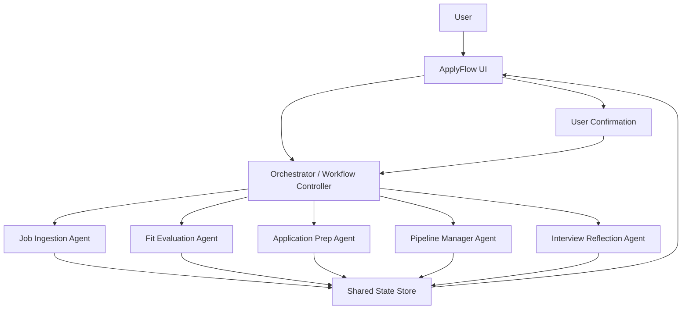
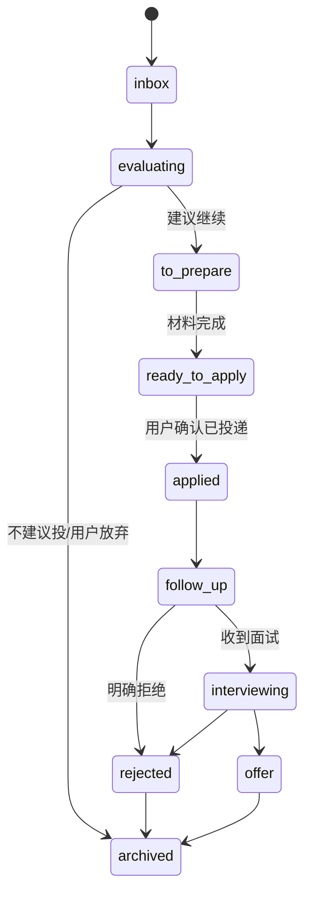
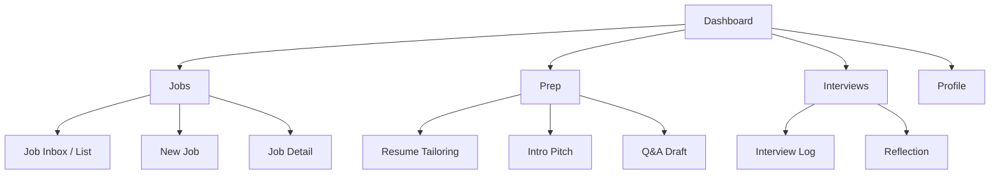

# ApplyFlow 正式设计 v1

日期：2026-04-14

基于文档：
- `ApplyFlow_项目重构总结_2026-04-14.md`

---

## 1. 文档目标

本文件用于把 ApplyFlow 从“项目方向”推进到“可开发设计”阶段，覆盖三部分：
- Agent 架构图
- 系统状态机
- 页面级 PRD

本版目标不是一次性定义最终产品，而是为接下来的 3 周 MVP 开发提供一套足够清晰、可直接拆任务的设计底稿。

---

## 2. 产品定义回顾

### 2.1 一句话定义

> ApplyFlow 是一个半自动求职执行 Agent，帮助求职者完成从筛岗、定制简历、投递准备、状态跟进到面试复盘的一整套求职执行闭环。

### 2.2 核心价值

ApplyFlow 解决的不是“用户不知道怎么求职”，而是：
- 知道该做什么，但执行链路断裂
- 多岗位并行时管理混乱
- 每个岗位都要重复做定制准备
- 面试经验无法有效回流到下一轮申请

### 2.3 首版定位

ApplyFlow v1 是：
- 半自动
- 面向真实个人求职者
- 以执行闭环为核心
- 强调状态管理、材料生成、任务推进和反馈复盘

ApplyFlow v1 不是：
- 自动海投机器人
- 自动提交系统
- 大规模岗位抓取平台
- 企业 ATS

---

## 3. Agent 架构设计

## 3.1 设计原则

Agent 架构不是为了“显得高级”，而是为了解决以下真实问题：
- 任务是多步骤的
- 同一岗位会跨多个阶段反复处理
- 不同阶段需要不同类型的语义处理
- 系统需要维护共享状态，而不是每次重新聊天
- 高风险动作必须保留人工确认

因此推荐架构为：

> 单主控 Orchestrator + 5 个功能 Agent + 统一状态存储 + 明确人工确认点

## 3.2 Agent 列表

### 3.2.1 Orchestrator / Workflow Controller

职责：
- 接收用户在各页面触发的动作
- 判断当前岗位处于哪个状态
- 决定调用哪个 Agent
- 读取和更新共享对象
- 维护任务顺序与输出上下文
- 在高风险动作前中断并要求用户确认

输入：
- 用户动作
- Job 数据
- UserProfile 数据
- 历史评估结果
- 历史申请准备结果
- 面试复盘数据

输出：
- 某个 Agent 的任务请求
- 状态更新
- UI 需要展示的结构化结果

### 3.2.2 Job Ingestion Agent

职责：
- 读取岗位链接或 JD 文本
- 提取公司、岗位、地点、要求、偏好项、风险项
- 产出结构化 Job 对象
- 做基础去重和字段清洗

边界：
- 首版不做复杂网页自动抓取适配
- 无法解析时允许用户手动补录

### 3.2.3 Fit Evaluation Agent

职责：
- 基于 Job + UserProfile 做匹配评估
- 输出匹配分、建议、缺口、风险、推荐策略

输出重点：
- `fit_score`
- `recommendation`
- `why_apply`
- `key_gaps`
- `risk_flags`
- `suggested_action`

### 3.2.4 Application Prep Agent

职责：
- 基于岗位要求与用户画像生成申请材料草稿
- 输出简历 bullet 改写、项目表达、自我介绍、Q&A、投递备注

边界：
- 只能重写和组织已有经历
- 不能编造经历、成果、数字

### 3.2.5 Pipeline Manager Agent

职责：
- 维护岗位状态流转建议
- 生成待办、跟进提醒和下一步动作
- 识别久未更新的岗位并提示处理

典型输出：
- `next_task`
- `follow_up_due`
- `status_suggestion`
- `stale_warning`

### 3.2.6 Interview Reflection Agent

职责：
- 基于面试记录做复盘
- 识别失败点、亮点、表达问题、能力缺口
- 提出可执行改进建议
- 把复盘洞察回流到求职策略

### 3.2.7 Optional: Analytics Agent

MVP 可不单独实现为 Agent，也可先作为普通服务逻辑。

职责：
- 统计投递漏斗
- 输出阶段转化
- 识别本周执行节奏
- 辅助回答“策略是否在改善”

---

## 3.3 共享状态层

所有 Agent 都不应各自持有孤立上下文，而应围绕统一对象工作。

推荐的共享对象：
- `UserProfile`
- `Job`
- `FitAssessment`
- `ApplicationPrep`
- `ApplicationTask`
- `InterviewReflection`
- `ActivityLog`

设计原则：
- Agent 输出必须结构化
- UI 展示只依赖共享对象，不直接依赖原始 prompt
- 允许用户编辑对象内容并覆盖 AI 输出
- 每次关键动作都写入 ActivityLog，便于后续审计和 demo 展示

---

## 3.4 人机边界设计

以下动作必须由系统辅助，但最终由用户确认：
- 是否值得投
- 是否采纳生成的简历改写
- 是否正式投递
- 是否发送跟进邮件
- 是否采纳复盘建议并调整策略

以下动作系统可以自动完成：
- 结构化解析 JD
- 生成匹配评估
- 生成材料草稿
- 生成待办和提醒建议
- 生成面试复盘建议

---

## 3.5 Agent 架构图

---

## 3.6 核心运行链路

### 3.6.1 新岗位进入

1. 用户输入岗位链接或 JD 文本
2. Orchestrator 调用 Job Ingestion Agent
3. 系统生成结构化 Job
4. Orchestrator 调用 Fit Evaluation Agent
5. 系统生成匹配评估
6. UI 展示“建议投 / 谨慎投 / 暂不投”
7. 用户决定是否进入申请准备阶段

### 3.6.2 材料准备

1. 用户点击“开始准备”
2. Orchestrator 读取 Job + UserProfile
3. 调用 Application Prep Agent
4. 生成简历改写、自我介绍、Q&A、备注
5. 用户编辑后确认
6. 状态进入 `ready_to_apply`

### 3.6.3 投递推进

1. 用户实际完成外部投递
2. 回到系统点击“标记已投递”
3. Orchestrator 更新状态为 `applied`
4. Pipeline Manager Agent 生成后续跟进任务

### 3.6.4 面试复盘

1. 用户进入面试复盘页填写信息
2. Orchestrator 调用 Interview Reflection Agent
3. 系统输出亮点、问题、优化建议、策略反馈
4. 用户可将部分洞察写回 Profile 偏好或素材库

---

## 4. 系统状态机设计

## 4.1 Job 生命周期状态

推荐状态：
- `inbox`
- `evaluating`
- `to_prepare`
- `ready_to_apply`
- `applied`
- `follow_up`
- `interviewing`
- `rejected`
- `offer`
- `archived`

### 4.1.1 状态定义

`inbox`
- 新录入岗位，尚未开始分析

`evaluating`
- 正在做岗位解析和匹配判断

`to_prepare`
- 判断值得投，但申请材料尚未准备完成

`ready_to_apply`
- 简历和申请内容已准备，等待用户实际投递

`applied`
- 用户已完成正式投递

`follow_up`
- 已投递且进入跟进阶段，等待反馈或建议联系

`interviewing`
- 已进入面试流程

`rejected`
- 已确认被拒

`offer`
- 已拿到 offer

`archived`
- 用户决定不再继续推进或历史归档

---

## 4.2 状态流转图

---

## 4.3 状态流转规则

### 4.3.1 自动触发

系统可自动触发：
- 新建 Job 后从 `inbox -> evaluating`
- 评估完成且推荐继续时，从 `evaluating -> to_prepare`
- 材料全部生成完成后建议进入 `ready_to_apply`
- 已投递超过设定时间未更新时，建议进入或保持 `follow_up`

### 4.3.2 用户确认触发

必须用户触发：
- `ready_to_apply -> applied`
- `follow_up -> interviewing`
- 任意状态 -> `rejected`
- 任意状态 -> `offer`
- 任意状态 -> `archived`

### 4.3.3 不允许的流转

首版建议限制：
- `inbox -> applied`
- `evaluating -> applied`
- `to_prepare -> applied`

原因：
- 避免绕开关键准备过程
- 强化产品的“执行闭环”叙事
- 便于后续数据统计和流程解释

---

## 4.4 任务状态机

除了 Job 状态，还需要轻量任务状态支持执行感。

任务状态：
- `todo`
- `in_progress`
- `done`
- `skipped`

典型任务类型：
- 完善用户画像
- 补充 JD 字段
- 修改简历 bullet
- 准备自我介绍
- 完成正式投递
- 发送跟进
- 填写面试复盘

建议规则：
- 每个 Job 至少显示一个当前主任务
- Dashboard 聚合所有 `todo` 和逾期任务

---

## 4.5 异常与回退策略

### 4.5.1 JD 无法解析

处理方式：
- 保留原文
- 展示“解析不完整”
- 引导用户手动补充岗位名称、公司、地点和关键要求

### 4.5.2 匹配评估置信不足

处理方式：
- 展示“信息不足，建议人工补充”
- 标注缺失字段，例如：
  - 年限要求不明确
  - 职能范围模糊
  - 行业背景要求不完整

### 4.5.3 材料生成质量不高

处理方式：
- 支持重新生成
- 支持保留多个版本
- 用户可只采纳部分建议

### 4.5.4 用户长期未更新状态

处理方式：
- Pipeline Manager 生成 `stale_warning`
- Dashboard 展示“超过 X 天未更新”的岗位

---

## 5. 页面级 PRD

## 5.1 信息架构总览

一级导航：
- Dashboard
- Jobs
- Prep
- Interviews
- Profile

推荐结构图：

---

## 5.2 Dashboard

### 页面目标

让用户一进入系统就知道：
- 现在有哪些岗位最值得推进
- 今天应该先做什么
- 哪些岗位卡住了
- 当前求职漏斗大致如何

### 核心模块

#### 1. 今日待办

展示内容：
- 待准备岗位
- 待投递岗位
- 待跟进岗位
- 待复盘面试

每条卡片字段：
- 岗位名
- 公司名
- 当前状态
- 推荐动作
- 截止时间或建议时间

#### 2. Pipeline Summary

展示：
- Inbox 数
- 待准备数
- 待投递数
- 已投递数
- 面试中数
- Offer 数

#### 3. 需要关注

展示：
- 超过 7 天未更新岗位
- 评估信息不足岗位
- 材料尚未完成岗位

#### 4. 本周进展

展示：
- 新增岗位数
- 已投递数
- 收到面试数
- 完成复盘数

### 主要按钮

- `新增岗位`
- `完善画像`
- `查看全部待办`
- `进入岗位详情`

### 空状态

初始空状态文案重点：
- 引导先完善 Profile
- 再添加第一个岗位

---

## 5.3 Profile 页面

### 页面目标

建立系统长期复用的求职画像，减少后续重复输入，提高评估和内容生成质量。

### 信息分区

#### 1. 基础信息

字段：
- 姓名
- 当前角色/背景
- 工作年限
- 教育背景

#### 2. 求职目标

字段：
- 目标岗位
- 目标行业
- 目标城市
- 可接受远程/异地
- 薪资预期

#### 3. 核心经历素材

字段：
- 代表性项目
- 管理/业务/增长/运营/战略经验
- 可复用成果描述
- 关键数字与案例

#### 4. 优势标签

字段：
- 核心优势
- 擅长场景
- 可强调关键词

#### 5. 约束条件

字段：
- 不考虑岗位类型
- 不考虑行业
- 不接受工作地点
- 风险偏好

#### 6. 基础简历

字段：
- 原始简历文本
- 附件链接或版本备注

### 主要按钮

- `保存画像`
- `生成标准画像摘要`
- `更新偏好`

### 关键交互

- 支持先填写基础版，后续不断补充
- 支持 AI 将长文本整理成结构化画像
- 支持人工直接改写结构化字段

### 异常状态

- 基础简历为空时，允许继续，但在生成申请材料时提示补充

---

## 5.4 Jobs 列表页

### 页面目标

集中查看所有岗位，并按状态和优先级快速筛选。

### 默认展示字段

- 公司
- 岗位名称
- 城市
- 状态
- 匹配分
- 建议动作
- 更新时间

### 筛选项

- 状态
- 城市
- 匹配分区间
- 最近更新时间
- 是否需要跟进

### 排序项

- 最近更新
- 匹配分
- 创建时间

### 主要按钮

- `新增岗位`
- `批量归档`
- `查看详情`

### 空状态

- 无岗位时：引导新增岗位
- 无筛选结果时：提示清空筛选

---

## 5.5 New Job 页面

### 页面目标

尽可能低成本地把一个岗位带入系统。

### 输入方式

#### 1. 链接输入

字段：
- Job URL

#### 2. 文本输入

字段：
- JD 原文文本框

#### 3. 手动补充

字段：
- 公司名
- 岗位名
- 城市
- 来源平台

### 提交后动作

- 进入 `evaluating`
- 触发 JD 解析
- 触发匹配评估
- 自动跳转到 Job Detail 或评估结果页

### 异常处理

- 如果链接不可用，允许仅保存链接和手动补充字段
- 如果 JD 太短，提示可能影响评估质量

---

## 5.6 Job Detail 页面

### 页面目标

把单个岗位的全部关键信息汇集在一页，成为该岗位的操作中枢。

### 页面模块

#### 1. Header 区

展示：
- 公司名
- 岗位名
- 城市
- 当前状态
- 匹配分
- 最后更新时间

按钮：
- `开始准备`
- `标记已投递`
- `更新状态`
- `归档`

#### 2. 岗位摘要区

展示：
- 岗位职责摘要
- 必要要求
- 加分项
- 风险点
- 原始 JD 折叠区

#### 3. 匹配评估区

展示：
- 推荐结论
- 匹配理由
- 关键缺口
- 风险提示
- 建议动作

按钮：
- `重新评估`

#### 4. 申请准备区

展示：
- 简历改写摘要
- 自我介绍草稿
- 问答草稿
- Checklist 状态

按钮：
- `进入完整准备页`
- `重新生成`

#### 5. 流程时间线

展示：
- 新建时间
- 评估时间
- 材料生成时间
- 投递时间
- 跟进记录
- 面试记录

#### 6. 下一步动作

展示：
- 当前最优下一步
- 推荐完成时间
- 风险提醒

### 关键交互

- 若尚未完成材料准备，`标记已投递` 按钮默认弱提示或二次确认
- 如果匹配分过低但用户仍想继续，允许继续，但标记为“逆推荐推进”

---

## 5.7 Prep 页面

### 页面目标

把“为某个岗位准备申请材料”的所有动作集中处理。

### 子模块

#### 1. Resume Tailoring

展示：
- 岗位目标关键词
- 建议强调经历
- 原始 bullet
- 改写 bullet

按钮：
- `生成改写`
- `保留原文`
- `采纳此版本`

#### 2. Self Intro

展示：
- 30 秒版本
- 60 秒版本
- 偏业务版
- 偏项目版

#### 3. Q&A Draft

建议生成问题：
- 为什么想来这家公司
- 为什么适合这个岗位
- 你的相关经历是什么
- 你的短板是什么
- 为什么转方向/换行业

#### 4. Apply Note / Cover Note

展示：
- 短版投递备注
- 稍长版 cover note

#### 5. Checklist

包含：
- 简历已检查
- 自我介绍已准备
- 问答草稿已看过
- 关键缺口有解释策略
- 已准备投递渠道

### 主要按钮

- `全部重新生成`
- `保存当前版本`
- `标记准备完成`

### 页面进入条件

- 必须绑定一个 Job

### 页面完成条件

- 至少有一套可采纳内容
- Checklist 核心项完成
- Job 状态可进入 `ready_to_apply`

---

## 5.8 Interviews 页面

### 页面目标

让用户把面试后的碎片记录转成可复用的复盘结论。

### 信息分区

#### 1. 面试基本信息

字段：
- 关联岗位
- 面试轮次
- 面试时间
- 面试官类型

#### 2. 面试记录

字段：
- 被问到的问题
- 自己的回答要点
- 哪些地方答得不顺
- 面试官反馈

#### 3. AI 复盘结果

展示：
- 本轮亮点
- 失分点
- 需要补强的能力/表达
- 下次应对建议
- 对求职策略的反馈

#### 4. 策略回流

可回写内容：
- 更新 Profile 优势表述
- 增补项目案例
- 调整目标岗位策略

### 主要按钮

- `生成复盘`
- `写回画像`
- `关联到岗位`

### 空状态

- 没有面试记录时，引导从某个岗位详情进入

---

## 5.9 Analytics / 轻量统计页

MVP 可以先并入 Dashboard，也可以后续拆页。

建议展示：
- 各状态岗位数量
- 本周新增与投递
- 面试转化率
- 复盘完成率
- 每个岗位平均准备时间

价值：
- 让项目更像产品
- 让面试讲述更有“业务指标”支撑

---

## 6. 页面到 Agent 的映射关系

| 页面 | 用户动作 | Orchestrator 调用 | 输出结果 |
|---|---|---|---|
| Profile | 保存画像 | 可不走 Agent 或走画像整理逻辑 | 标准化 UserProfile |
| New Job | 提交岗位 | Job Ingestion Agent | 结构化 Job |
| New Job / Job Detail | 开始评估 | Fit Evaluation Agent | 匹配评估 |
| Prep | 生成材料 | Application Prep Agent | 简历改写与草稿 |
| Job Detail / Dashboard | 更新状态 | Pipeline Manager Agent | 下一步动作与提醒 |
| Interviews | 生成复盘 | Interview Reflection Agent | 复盘建议与策略反馈 |

---

## 7. MVP 数据与日志设计建议

为了后续展示“不是一次性 prompt 工具”，建议从首版就保留以下日志：
- Job 创建日志
- 评估生成日志
- 材料生成日志
- 状态变更日志
- 面试复盘生成日志

每条日志至少包括：
- 对象 ID
- 动作类型
- 时间
- 触发来源
- 结果摘要

这样可以支持：
- Timeline 展示
- 调试 bad case
- 面试时讲工程思路

---

## 8. 首版开发优先级建议

### P0

- Profile 页面
- New Job 页面
- Job Detail 页面
- Fit Assessment
- Prep 页面
- 基础状态流转
- Dashboard 简版

### P1

- Interviews 页面
- Task / Reminder 机制
- Timeline 日志
- Analytics 简版

### P2

- 多版本材料管理
- 更细粒度的提醒策略
- 外部系统同步

---

## 9. 设计决策总结

ApplyFlow 正式设计 v1 的关键取舍是：

### 9.1 不追求全自动

因为真正有价值的是“推进执行闭环”，不是“炫技自动提交”。

### 9.2 先围绕单用户、单工作台做深

因为 MVP 的核心是验证一个求职者能否持续使用，而不是构建大而全平台。

### 9.3 用状态机和共享对象支撑 Agent 叙事

因为只有 prompt 拆分不够，必须能说明：
- 谁在什么时候做什么
- 输出如何被保存
- 下一步如何被触发

### 9.4 页面必须围绕动作，而不是围绕聊天

因为产品核心是“推进求职任务”，不是“问一个问题得到一段建议”。

---

## 10. 下一步建议

完成本文件后，建议继续输出两份文档：

### 10.1 技术设计文档 v1

内容包括：
- 前后端模块划分
- 数据模型 Schema
- API 设计
- Agent 调用链路
- 存储方案
- 日志方案

### 10.2 面试讲稿与 Demo 脚本

内容包括：
- 项目一句话介绍
- 为什么做这个
- 为什么是 Agent 而不是普通 AI 工具
- 为什么边界设为半自动
- 真实 case 如何演示

---

## 11. 当前版本一句话总结

> ApplyFlow v1 应被设计成一个以 Job 为核心对象、以状态机为骨架、以 Agent 编排为能力层、以页面工作台为交互载体的半自动求职执行系统。
