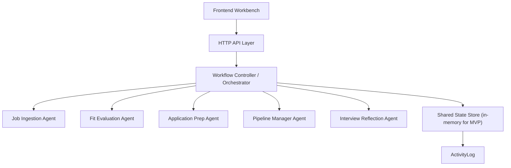

# ApplyFlow Technical Design v1

日期：2026-04-14

## 1. 目标

本设计文档定义 ApplyFlow MVP 的工程落地方案，目标是用最轻量的方式搭建一个可 demo、可继续开发、能体现共享状态和 Agent 编排的 MVP 骨架。

本版本优先实现：
- 统一共享对象模型
- Job 生命周期状态机
- Orchestrator + Agent stub
- Mock API
- 可展示前端工作台
- Demo 数据流

本版本暂不实现：
- 真实数据库
- 真实 LLM 推理
- 自动投递
- 浏览器自动化
- 重型知识库 / RAG

## 2. 总体架构



## 3. 前端模块划分

| 模块 | 责任 |
|---|---|
| `Dashboard` | 展示关键指标、待办、近期岗位 |
| `Jobs` | 岗位列表、状态、匹配分 |
| `Job Detail` | 单岗位中枢页，串联评估、准备、状态更新、日志 |
| `Prep` | 展示申请材料准备结果 |
| `Interviews` | 面试复盘录入和回放 |
| `Profile` | 用户画像查看与编辑 |
| `Client Router` | 根据 hash 渲染页面 |
| `API Client` | 请求后端 mock API |

## 4. 后端模块划分

| 模块 | 文件建议 | 责任 |
|---|---|---|
| HTTP 入口 | `server.js` | 启动 server |
| Request Router | `src/server/app.js` | 静态资源与 API 分发 |
| In-memory Store | `src/server/store.js` | 统一共享状态读写 |
| API Handlers | `src/server/routes/api.js` | 定义 REST 风格接口 |
| Orchestrator | `src/lib/orchestrator/workflow-controller.js` | 编排 Agent 与状态更新 |
| Agent Registry | `src/lib/orchestrator/agent-registry.js` | 维护 Agent 实现映射 |
| Per-agent Stubs | `src/lib/orchestrator/agents/*` | 各功能 Agent 的结构化输出 |
| State Machine | `src/lib/state/job-status.js` | 状态枚举与流转校验 |
| Mock Data | `src/mock/applyflow-demo-data.js` | 初始 demo 数据 |

## 5. Agent 调用链路

### 5.1 新岗位导入

1. `POST /api/jobs/ingest`
2. API handler 调用 `orchestrator.ingestJob`
3. `Job Ingestion Agent` 返回结构化 Job
4. Store 保存 Job
5. 自动写入 `ActivityLog`

### 5.2 匹配评估

1. `POST /api/jobs/:id/evaluate`
2. API handler 调用 `orchestrator.evaluateJob`
3. `Fit Evaluation Agent` 返回 `FitAssessment`
4. 更新 Job 的 `fitAssessmentId`
5. 根据结果建议状态流转到 `to_prepare` 或 `archived`
6. 写入 `ActivityLog`

### 5.3 申请材料准备

1. `POST /api/jobs/:id/prepare`
2. Orchestrator 读取 Job + Profile + FitAssessment
3. `Application Prep Agent` 返回 `ApplicationPrep`
4. 更新 Job 的 `applicationPrepId`
5. 若 checklist 达到最低要求，允许状态进入 `ready_to_apply`
6. 写入 `ActivityLog`

### 5.4 状态更新

1. `POST /api/jobs/:id/status`
2. Orchestrator 调用状态机校验
3. 若合法，更新 Job 状态
4. `Pipeline Manager Agent` 补充下一步建议和任务
5. 写入 `ActivityLog`

### 5.5 面试复盘

1. `POST /api/interviews/reflect`
2. `Interview Reflection Agent` 返回结构化复盘
3. 保存 `InterviewReflection`
4. 关联到 Job
5. 写入 `ActivityLog`

## 6. 共享状态对象设计

核心对象：
- `UserProfile`
- `Job`
- `FitAssessment`
- `ApplicationPrep`
- `ApplicationTask`
- `InterviewReflection`
- `ActivityLog`

### 6.1 共享状态结构

```json
{
  "profile": {},
  "jobs": [],
  "fitAssessments": [],
  "applicationPreps": [],
  "applicationTasks": [],
  "interviewReflections": [],
  "activityLogs": []
}
```

## 7. 数据模型 Schema

字段定义以 `src/types/applyflow.ts` 为准。下面给出简化版 JSON Schema 说明。

### 7.1 UserProfile

```json
{
  "type": "object",
  "required": ["id", "fullName", "headline", "targetRoles", "summary", "baseResume"],
  "properties": {
    "id": { "type": "string" },
    "fullName": { "type": "string" },
    "headline": { "type": "string" },
    "targetRoles": { "type": "array", "items": { "type": "string" } },
    "summary": { "type": "string" },
    "baseResume": { "type": "string" }
  }
}
```

### 7.2 Job

```json
{
  "type": "object",
  "required": ["id", "company", "title", "location", "jdRaw", "status"],
  "properties": {
    "status": {
      "type": "string",
      "enum": ["inbox", "evaluating", "to_prepare", "ready_to_apply", "applied", "follow_up", "interviewing", "rejected", "offer", "archived"]
    }
  }
}
```

### 7.3 FitAssessment

```json
{
  "type": "object",
  "required": ["id", "jobId", "profileId", "fitScore", "recommendation"]
}
```

### 7.4 ApplicationPrep

```json
{
  "type": "object",
  "required": ["id", "jobId", "profileId", "resumeTailoring", "selfIntro", "qaDraft", "checklist"]
}
```

### 7.5 InterviewReflection

```json
{
  "type": "object",
  "required": ["id", "jobId", "profileId", "roundName", "summary"]
}
```

### 7.6 ActivityLog

```json
{
  "type": "object",
  "required": ["id", "entityType", "entityId", "action", "actor", "summary", "createdAt"]
}
```

## 8. API 设计

统一成功格式：

```json
{
  "success": true,
  "data": {}
}
```

统一错误格式：

```json
{
  "success": false,
  "error": {
    "code": "INVALID_STATUS_TRANSITION",
    "message": "Cannot move job from to_prepare to applied.",
    "details": {
      "currentStatus": "to_prepare",
      "nextStatus": "applied"
    }
  }
}
```

### 8.1 `POST /api/profile/save`

Request:

```json
{
  "fullName": "Alex Chen",
  "headline": "MBA candidate pivoting into AI product roles",
  "targetRoles": ["AI Product Manager"],
  "summary": "Structured operator with product and strategy experience.",
  "baseResume": "Resume text..."
}
```

### 8.2 `GET /api/profile`

返回当前用户画像。

### 8.3 `POST /api/jobs/ingest`

Request:

```json
{
  "source": "url",
  "sourceLabel": "LinkedIn",
  "url": "https://jobs.example.com/new-role",
  "company": "Example AI",
  "title": "AI Product Manager",
  "location": "Shanghai",
  "jdRaw": "Own AI workflow product..."
}
```

### 8.4 `GET /api/jobs`

返回岗位列表。

### 8.5 `GET /api/jobs/:id`

返回岗位聚合详情：

```json
{
  "success": true,
  "data": {
    "job": {},
    "fitAssessment": {},
    "applicationPrep": {},
    "tasks": [],
    "activityLogs": [],
    "interviewReflection": {}
  }
}
```

### 8.6 `POST /api/jobs/:id/evaluate`

触发岗位评估，返回 `fitAssessment` 和更新后的 `job`。

### 8.7 `POST /api/jobs/:id/prepare`

生成申请材料，返回 `applicationPrep` 和更新后的 `job`。

### 8.8 `POST /api/jobs/:id/status`

Request:

```json
{
  "nextStatus": "applied"
}
```

### 8.9 `POST /api/interviews/reflect`

Request:

```json
{
  "jobId": "job_001",
  "roundName": "Hiring Manager Screen",
  "interviewerType": "Hiring Manager",
  "interviewDate": "2026-04-14T10:00:00.000Z",
  "questionsAsked": ["How do you work with engineering?"],
  "notes": "Need more concrete technical detail."
}
```

### 8.10 `GET /api/dashboard/summary`

返回：
- 状态数量
- 待办任务
- 最近岗位
- 需要跟进的岗位

## 9. 状态机实现方案

### 9.1 状态枚举

以 `src/lib/state/job-status.ts` 和 `src/lib/state/job-status.js` 为准。

### 9.2 流转校验

```ts
canTransitionJobStatus(currentStatus, nextStatus): boolean
```

### 9.3 校验落点

| 层 | 是否校验 |
|---|---|
| API handler | 是 |
| Orchestrator | 是 |
| 前端按钮可见性 | 是，弱校验 |

## 10. 日志 / ActivityLog 设计

记录范围：
- Profile 保存
- Job 导入
- FitAssessment 生成
- ApplicationPrep 生成
- Job 状态更新
- InterviewReflection 生成

核心字段：
- `entityType`
- `entityId`
- `action`
- `actor`
- `summary`
- `metadata`
- `createdAt`

## 11. 错误处理与回退策略

| 场景 | 处理 |
|---|---|
| 缺少必填字段 | `VALIDATION_ERROR` |
| Job 不存在 | `NOT_FOUND` |
| 非法状态流转 | `INVALID_STATUS_TRANSITION` |
| 缺少 Profile | `PROFILE_REQUIRED` |
| Agent 执行异常 | `AGENT_EXECUTION_FAILED` |

回退原则：
- JD 解析不完整时保留原始文本
- 没有评估结果也允许打开岗位详情
- 没有申请准备结果时 Prep 展示引导态
- 没有复盘时 Interviews 展示空状态

## 12. P0 / P1 开发优先级

### P0

- 统一对象模型
- 状态机与非法流转防护
- Demo 数据
- In-memory store
- Orchestrator
- 10 个核心 API
- Dashboard / Jobs / Job Detail / Prep / Profile 页面骨架
- README 与技术设计文档

### P1

- Interviews 页面增强
- 编辑和保存 ApplicationPrep
- Task 自动生成策略
- Dashboard 指标细化
- 真实持久化层
- 真实 LLM 接入

## 13. Demo 数据流说明

### Case A: 强推荐投递

1. 打开 Dashboard
2. 进入 `NovaMind AI / AI Product Manager`
3. 查看 `strong_yes` 评估
4. 进入 Prep 查看简历改写和自我介绍
5. 在 Job Detail 里更新为 `applied`

### Case B: 谨慎投递

1. 打开 Jobs
2. 查看 `Northstar Commerce / Senior Product Strategy Manager`
3. 观察 `cautious_yes` 与风险提示
4. 决定是否继续准备

### Case C: 不建议投递

1. 查看 `BluePeak Media / Director of Advertising Operations`
2. 观察 `no` 结论与 `archived` 状态
3. 作为“系统边界清晰”的示例展示
