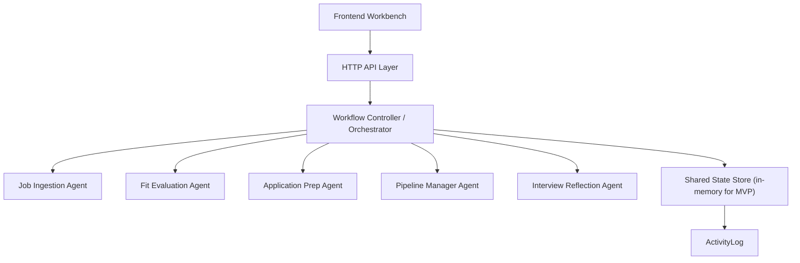

# 历史文档说明

> 本文档为历史记录，不再作为 ApplyFlow partial_rebuild 的当前基线。
> 当前重构基线请使用：
> - README.md
> - PROJECT_CONTEXT.md
> - docs/APPLYFLOW_REBUILD_PLAN.md
> - docs/APPLYFLOW_ARCHITECTURE.md
> - docs/DEPRECATION_AND_REMOVAL_PLAN.md

---

# ApplyFlow Technical Design v1

鏃ユ湡锛?026-04-14

## 1. 鐩爣

鏈璁℃枃妗ｅ畾涔?ApplyFlow MVP 鐨勫伐绋嬭惤鍦版柟妗堬紝鐩爣鏄敤鏈€杞婚噺鐨勬柟寮忔惌寤轰竴涓彲 demo銆佸彲缁х画寮€鍙戙€佽兘浣撶幇鍏变韩鐘舵€佸拰 Agent 缂栨帓鐨?MVP 楠ㄦ灦銆?
鏈増鏈紭鍏堝疄鐜帮細
- 缁熶竴鍏变韩瀵硅薄妯″瀷
- Job 鐢熷懡鍛ㄦ湡鐘舵€佹満
- Orchestrator + Agent stub
- Mock API
- 鍙睍绀哄墠绔伐浣滃彴
- Demo 鏁版嵁娴?
鏈増鏈殏涓嶅疄鐜帮細
- 鐪熷疄鏁版嵁搴?- 鐪熷疄 LLM 鎺ㄧ悊
- 鑷姩鎶曢€?- 娴忚鍣ㄨ嚜鍔ㄥ寲
- 閲嶅瀷鐭ヨ瘑搴?/ RAG

## 2. 鎬讳綋鏋舵瀯



## 3. 鍓嶇妯″潡鍒掑垎

| 妯″潡 | 璐ｄ换 |
|---|---|
| `Dashboard` | 灞曠ず鍏抽敭鎸囨爣銆佸緟鍔炪€佽繎鏈熷矖浣?|
| `Jobs` | 宀椾綅鍒楄〃銆佺姸鎬併€佸尮閰嶅垎 |
| `Job Detail` | 鍗曞矖浣嶄腑鏋㈤〉锛屼覆鑱旇瘎浼般€佸噯澶囥€佺姸鎬佹洿鏂般€佹棩蹇?|
| `Prep` | 灞曠ず鐢宠鏉愭枡鍑嗗缁撴灉 |
| `Interviews` | 闈㈣瘯澶嶇洏褰曞叆鍜屽洖鏀?|
| `Profile` | 鐢ㄦ埛鐢诲儚鏌ョ湅涓庣紪杈?|
| `Client Router` | 鏍规嵁 hash 娓叉煋椤甸潰 |
| `API Client` | 璇锋眰鍚庣 mock API |

## 4. 鍚庣妯″潡鍒掑垎

| 妯″潡 | 鏂囦欢寤鸿 | 璐ｄ换 |
|---|---|---|
| HTTP 鍏ュ彛 | `server.js` | 鍚姩 server |
| Request Router | `src/server/app.js` | 闈欐€佽祫婧愪笌 API 鍒嗗彂 |
| In-memory Store | `src/server/store.js` | 缁熶竴鍏变韩鐘舵€佽鍐?|
| API Handlers | `src/server/routes/api.js` | 瀹氫箟 REST 椋庢牸鎺ュ彛 |
| Orchestrator | `src/lib/orchestrator/workflow-controller.js` | 缂栨帓 Agent 涓庣姸鎬佹洿鏂?|
| Agent Registry | `src/lib/orchestrator/agent-registry.js` | 缁存姢 Agent 瀹炵幇鏄犲皠 |
| Per-agent Stubs | `src/lib/orchestrator/agents/*` | 鍚勫姛鑳?Agent 鐨勭粨鏋勫寲杈撳嚭 |
| State Machine | `src/lib/state/job-status.js` | 鐘舵€佹灇涓句笌娴佽浆鏍￠獙 |
| Mock Data | `src/mock/applyflow-demo-data.js` | 鍒濆 demo 鏁版嵁 |

## 5. Agent 璋冪敤閾捐矾

### 5.1 鏂板矖浣嶅鍏?
1. `POST /api/jobs/ingest`
2. API handler 璋冪敤 `orchestrator.ingestJob`
3. `Job Ingestion Agent` 杩斿洖缁撴瀯鍖?Job
4. Store 淇濆瓨 Job
5. 鑷姩鍐欏叆 `ActivityLog`

### 5.2 鍖归厤璇勪及

1. `POST /api/jobs/:id/evaluate`
2. API handler 璋冪敤 `orchestrator.evaluateJob`
3. `Fit Evaluation Agent` 杩斿洖 `FitAssessment`
4. 鏇存柊 Job 鐨?`fitAssessmentId`
5. 鏍规嵁缁撴灉寤鸿鐘舵€佹祦杞埌 `to_prepare` 鎴?`archived`
6. 鍐欏叆 `ActivityLog`

### 5.3 鐢宠鏉愭枡鍑嗗

1. `POST /api/jobs/:id/prepare`
2. Orchestrator 璇诲彇 Job + Profile + FitAssessment
3. `Application Prep Agent` 杩斿洖 `ApplicationPrep`
4. 鏇存柊 Job 鐨?`applicationPrepId`
5. 鑻?checklist 杈惧埌鏈€浣庤姹傦紝鍏佽鐘舵€佽繘鍏?`ready_to_apply`
6. 鍐欏叆 `ActivityLog`

### 5.4 鐘舵€佹洿鏂?
1. `POST /api/jobs/:id/status`
2. Orchestrator 璋冪敤鐘舵€佹満鏍￠獙
3. 鑻ュ悎娉曪紝鏇存柊 Job 鐘舵€?4. `Pipeline Manager Agent` 琛ュ厖涓嬩竴姝ュ缓璁拰浠诲姟
5. 鍐欏叆 `ActivityLog`

### 5.5 闈㈣瘯澶嶇洏

1. `POST /api/interviews/reflect`
2. `Interview Reflection Agent` 杩斿洖缁撴瀯鍖栧鐩?3. 淇濆瓨 `InterviewReflection`
4. 鍏宠仈鍒?Job
5. 鍐欏叆 `ActivityLog`

## 6. 鍏变韩鐘舵€佸璞¤璁?
鏍稿績瀵硅薄锛?- `UserProfile`
- `Job`
- `FitAssessment`
- `ApplicationPrep`
- `ApplicationTask`
- `InterviewReflection`
- `ActivityLog`

### 6.1 鍏变韩鐘舵€佺粨鏋?
```json
{
  "profile": {},
  "jobs": [],
  "fitAssessments": [],
  "applicationPreps": [],
  "applicationTasks": [],
  "interviewReflections": [],
  "activityLogs": []
}
```

## 7. 鏁版嵁妯″瀷 Schema

瀛楁瀹氫箟浠?`src/types/applyflow.ts` 涓哄噯銆備笅闈㈢粰鍑虹畝鍖栫増 JSON Schema 璇存槑銆?
### 7.1 UserProfile

```json
{
  "type": "object",
  "required": ["id", "fullName", "headline", "targetRoles", "summary", "baseResume"],
  "properties": {
    "id": { "type": "string" },
    "fullName": { "type": "string" },
    "headline": { "type": "string" },
    "targetRoles": { "type": "array", "items": { "type": "string" } },
    "summary": { "type": "string" },
    "baseResume": { "type": "string" }
  }
}
```

### 7.2 Job

```json
{
  "type": "object",
  "required": ["id", "company", "title", "location", "jdRaw", "status"],
  "properties": {
    "status": {
      "type": "string",
      "enum": ["inbox", "evaluating", "to_prepare", "ready_to_apply", "applied", "follow_up", "interviewing", "rejected", "offer", "archived"]
    }
  }
}
```

### 7.3 FitAssessment

```json
{
  "type": "object",
  "required": ["id", "jobId", "profileId", "fitScore", "recommendation"]
}
```

### 7.4 ApplicationPrep

```json
{
  "type": "object",
  "required": ["id", "jobId", "profileId", "resumeTailoring", "selfIntro", "qaDraft", "checklist"]
}
```

### 7.5 InterviewReflection

```json
{
  "type": "object",
  "required": ["id", "jobId", "profileId", "roundName", "summary"]
}
```

### 7.6 ActivityLog

```json
{
  "type": "object",
  "required": ["id", "entityType", "entityId", "action", "actor", "summary", "createdAt"]
}
```

## 8. API 璁捐

缁熶竴鎴愬姛鏍煎紡锛?
```json
{
  "success": true,
  "data": {}
}
```

缁熶竴閿欒鏍煎紡锛?
```json
{
  "success": false,
  "error": {
    "code": "INVALID_STATUS_TRANSITION",
    "message": "Cannot move job from to_prepare to applied.",
    "details": {
      "currentStatus": "to_prepare",
      "nextStatus": "applied"
    }
  }
}
```

### 8.1 `POST /api/profile/save`

Request:

```json
{
  "fullName": "Alex Chen",
  "headline": "MBA candidate pivoting into AI product roles",
  "targetRoles": ["AI Product Manager"],
  "summary": "Structured operator with product and strategy experience.",
  "baseResume": "Resume text..."
}
```

### 8.2 `GET /api/profile`

杩斿洖褰撳墠鐢ㄦ埛鐢诲儚銆?
### 8.3 `POST /api/jobs/ingest`

Request:

```json
{
  "source": "url",
  "sourceLabel": "LinkedIn",
  "url": "https://jobs.example.com/new-role",
  "company": "Example AI",
  "title": "AI Product Manager",
  "location": "Shanghai",
  "jdRaw": "Own AI workflow product..."
}
```

### 8.4 `GET /api/jobs`

杩斿洖宀椾綅鍒楄〃銆?
### 8.5 `GET /api/jobs/:id`

杩斿洖宀椾綅鑱氬悎璇︽儏锛?
```json
{
  "success": true,
  "data": {
    "job": {},
    "fitAssessment": {},
    "applicationPrep": {},
    "tasks": [],
    "activityLogs": [],
    "interviewReflection": {}
  }
}
```

### 8.6 `POST /api/jobs/:id/evaluate`

瑙﹀彂宀椾綅璇勪及锛岃繑鍥?`fitAssessment` 鍜屾洿鏂板悗鐨?`job`銆?
### 8.7 `POST /api/jobs/:id/prepare`

鐢熸垚鐢宠鏉愭枡锛岃繑鍥?`applicationPrep` 鍜屾洿鏂板悗鐨?`job`銆?
### 8.8 `POST /api/jobs/:id/status`

Request:

```json
{
  "nextStatus": "applied"
}
```

### 8.9 `POST /api/interviews/reflect`

Request:

```json
{
  "jobId": "job_001",
  "roundName": "Hiring Manager Screen",
  "interviewerType": "Hiring Manager",
  "interviewDate": "2026-04-14T10:00:00.000Z",
  "questionsAsked": ["How do you work with engineering?"],
  "notes": "Need more concrete technical detail."
}
```

### 8.10 `GET /api/dashboard/summary`

杩斿洖锛?- 鐘舵€佹暟閲?- 寰呭姙浠诲姟
- 鏈€杩戝矖浣?- 闇€瑕佽窡杩涚殑宀椾綅

## 9. 鐘舵€佹満瀹炵幇鏂规

### 9.1 鐘舵€佹灇涓?
浠?`src/lib/state/job-status.ts` 鍜?`src/lib/state/job-status.js` 涓哄噯銆?
### 9.2 娴佽浆鏍￠獙

```ts
canTransitionJobStatus(currentStatus, nextStatus): boolean
```

### 9.3 鏍￠獙钀界偣

| 灞?| 鏄惁鏍￠獙 |
|---|---|
| API handler | 鏄?|
| Orchestrator | 鏄?|
| 鍓嶇鎸夐挳鍙鎬?| 鏄紝寮辨牎楠?|

## 10. 鏃ュ織 / ActivityLog 璁捐

璁板綍鑼冨洿锛?- Profile 淇濆瓨
- Job 瀵煎叆
- FitAssessment 鐢熸垚
- ApplicationPrep 鐢熸垚
- Job 鐘舵€佹洿鏂?- InterviewReflection 鐢熸垚

鏍稿績瀛楁锛?- `entityType`
- `entityId`
- `action`
- `actor`
- `summary`
- `metadata`
- `createdAt`

## 11. 閿欒澶勭悊涓庡洖閫€绛栫暐

| 鍦烘櫙 | 澶勭悊 |
|---|---|
| 缂哄皯蹇呭～瀛楁 | `VALIDATION_ERROR` |
| Job 涓嶅瓨鍦?| `NOT_FOUND` |
| 闈炴硶鐘舵€佹祦杞?| `INVALID_STATUS_TRANSITION` |
| 缂哄皯 Profile | `PROFILE_REQUIRED` |
| Agent 鎵ц寮傚父 | `AGENT_EXECUTION_FAILED` |

鍥為€€鍘熷垯锛?- JD 瑙ｆ瀽涓嶅畬鏁存椂淇濈暀鍘熷鏂囨湰
- 娌℃湁璇勪及缁撴灉涔熷厑璁告墦寮€宀椾綅璇︽儏
- 娌℃湁鐢宠鍑嗗缁撴灉鏃?Prep 灞曠ず寮曞鎬?- 娌℃湁澶嶇洏鏃?Interviews 灞曠ず绌虹姸鎬?
## 12. P0 / P1 寮€鍙戜紭鍏堢骇

### P0

- 缁熶竴瀵硅薄妯″瀷
- 鐘舵€佹満涓庨潪娉曟祦杞槻鎶?- Demo 鏁版嵁
- In-memory store
- Orchestrator
- 10 涓牳蹇?API
- Dashboard / Jobs / Job Detail / Prep / Profile 椤甸潰楠ㄦ灦
- README 涓庢妧鏈璁℃枃妗?
### P1

- Interviews 椤甸潰澧炲己
- 缂栬緫鍜屼繚瀛?ApplicationPrep
- Task 鑷姩鐢熸垚绛栫暐
- Dashboard 鎸囨爣缁嗗寲
- 鐪熷疄鎸佷箙鍖栧眰
- 鐪熷疄 LLM 鎺ュ叆

## 13. Demo 鏁版嵁娴佽鏄?
### Case A: 寮烘帹鑽愭姇閫?
1. 鎵撳紑 Dashboard
2. 杩涘叆 `NovaMind AI / AI Product Manager`
3. 鏌ョ湅 `strong_yes` 璇勪及
4. 杩涘叆 Prep 鏌ョ湅绠€鍘嗘敼鍐欏拰鑷垜浠嬬粛
5. 鍦?Job Detail 閲屾洿鏂颁负 `applied`

### Case B: 璋ㄦ厧鎶曢€?
1. 鎵撳紑 Jobs
2. 鏌ョ湅 `Northstar Commerce / Senior Product Strategy Manager`
3. 瑙傚療 `cautious_yes` 涓庨闄╂彁绀?4. 鍐冲畾鏄惁缁х画鍑嗗

### Case C: 涓嶅缓璁姇閫?
1. 鏌ョ湅 `BluePeak Media / Director of Advertising Operations`
2. 瑙傚療 `no` 缁撹涓?`archived` 鐘舵€?3. 浣滀负鈥滅郴缁熻竟鐣屾竻鏅扳€濈殑绀轰緥灞曠ず

