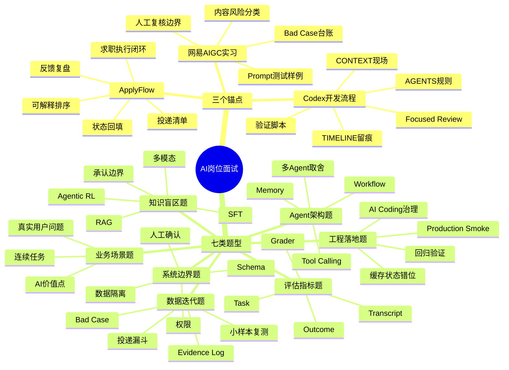
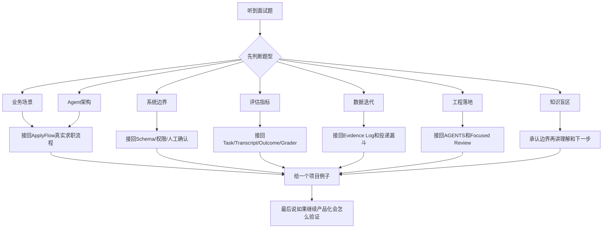

# AI 面试复习思维导图

最后更新：2026-05-19

## 0. 使用方式

这份文档不是用来全文背的，而是用来快速回忆面试地图。

复习顺序：

1. 先看下面的总思维导图，记住 3 个锚点和 7 类题。
2. 再看每一类下面的“接回项目”。
3. 遇到陌生题，先判断属于哪一类，再套对应回答。

## 1. 总思维导图

## 2. 三个主场

### ApplyFlow

一句话：

> 我做的是一个把求职从“拍脑袋海投”变成“岗位发现、可解释排序、投递清单、状态回填、反馈复盘”的 AI 求职执行系统。

能回答：

- 项目为什么不是玩具。
- 为什么需要 Agent。
- 怎么做排序和解释。
- 怎么做系统边界。
- 怎么做评估和用户反馈迭代。

### 网易 AIGC 内容安全策略实习

一句话：

> 网易实习让我理解 AIGC 产品不能只看生成效果，还要关注风险分类、Bad Case、策略口径、Prompt 边界和人工复核。

能回答：

- AIGC 和人工内容有什么区别。
- AI 输出不稳定怎么处理。
- Bad Case 怎么记录。
- 内容安全怎么做。
- 人机协同怎么理解。

### Codex 开发流程

一句话：

> 我的开发流程本身也是一个 Agent 治理案例：给 AI Coding Agent 上下文、规则、边界、验证和复盘。

能回答：

- 你是不是只会用 Codex。
- 用 AI Coding 遇到什么难点。
- 怎么防止模型误改。
- 怎么做回归验证。
- 怎么体现工程能力。

## 3. 七类题型速查

| 题型 | 听到这些词就归类 | 接回哪里 |
| --- | --- | --- |
| 业务场景题 | 用户、痛点、产品价值、为什么做 | ApplyFlow 求职执行闭环 |
| Agent 架构题 | workflow、ReAct、多 Agent、memory、tool | ApplyFlow workflow + 状态机 |
| 系统边界题 | 失控、注入、权限、隐私、人工确认 | Schema + 权限 + HITL |
| 评估指标题 | eval、benchmark、pass@k、模型升级 | Task / Transcript / Outcome / Grader |
| 数据迭代题 | 用户数据、指标、A/B、Bad Case | Evidence Log + 投递漏斗 |
| 工程落地题 | Codex、回归、缓存、部署、线上问题 | AGENTS.md + Focused Review |
| 知识盲区题 | RAG、SFT、RL、多模态、框架名 | 承认边界 + 项目映射 |

## 4. 陌生题回答流程图

## 5. 最小背诵卡

只背这 6 句：

1. 我会先从真实任务出发，不先堆技术名词。
2. 我把 AI 能力和确定性系统分开，模型做语义判断，系统做状态、权限和门禁。
3. Prompt 是软约束，Schema、校验、日志、人工确认才是硬治理。
4. 评估要看任务结果、执行轨迹和真实系统状态，不只看模型输出。
5. 我当前没有大规模线上数据，所以用小样本同口径复测、Evidence Log 和 Bad Case 证明迭代能力。
6. 不会的技术我不会硬装，会说明理解、项目映射和下一步落地路径。

## 6. Focused Review 自审记录

Correctness Findings：

- 本文档将现有 AI 面试准备压缩为 3 个锚点、7 类题型和 1 个陌生题回答流程。
- 内容与现有主手册、题型归类器和资料总索引保持一致。

Boundary/Safety Findings：

- 没有新增不存在的项目能力。
- 没有把 RAG、SFT、Agentic RL、多模态包装成已落地经验。
- 小样本指标仍明确为复测和 Evidence Log 口径。

Adversarial Scenarios Checked：

- 面试题太多背不完。
- 面试官问陌生 AI 概念。
- 用户需要从项目出发回答。
- 用户需要快速复习导航。

Blast Radius & Adjacent Regression Assessment：

- 本轮只新增复习导航文档，不影响产品代码、数据和部署。

Residual Risks：

- Mermaid 思维导图需要在支持 Mermaid 的编辑器或飞书/Markdown 工具中渲染；不支持时仍可按文本阅读。

Disposition：

- Unblocked。owner：项目作者。面试前优先看第 1、3、4、5 节。
